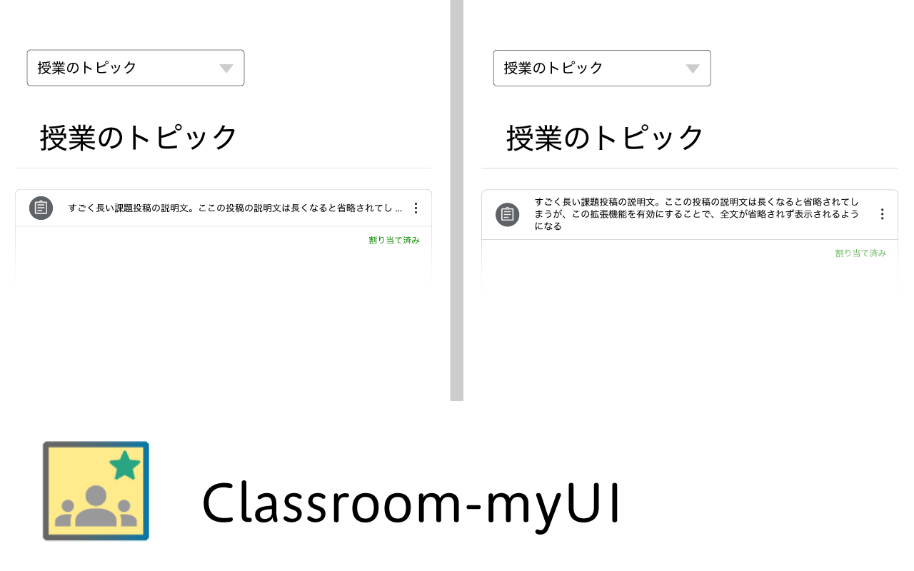

# classroom-myUI



Google classroomのUIを良くする（のかもしれない）拡張機能です

## インストール方法

### ・ Chrome Web Storeからインストールする方法(メイン)

[classroom-myUIの配布ページ](https://chromewebstore.google.com/detail/classroom-myui/fldjpemfcmojflhfcgldcbmpeodifbcf)にアクセスし、「Chromeに追加」ボタンを押す。

### ・ Chrome Web Storeを使用せずにインストールする方法

ターミナルに下記のコマンドをコピーし入力する

```bash
curl -s https://raw.githubusercontent.com/MizuYaYa/classroom-myUI/refs/heads/main/install.sh | bash
```

アンインストールする場合は

ターミナルに下記のコマンドをコピーし入力する

```bash
curl -s https://raw.githubusercontent.com/MizuYaYa/classroom-myUI/refs/heads/main/uninstall.sh | bash
```
